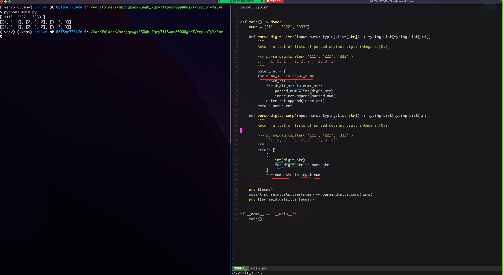
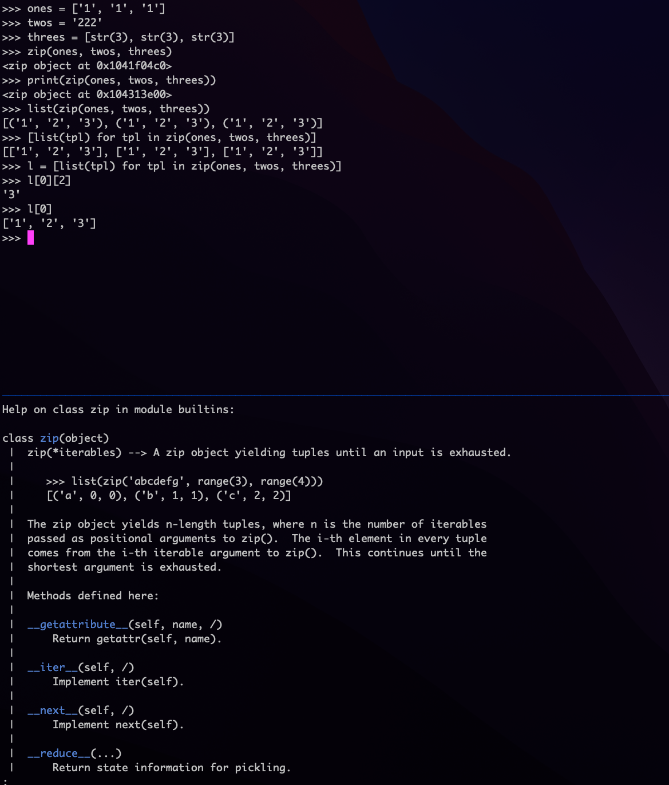

# 9/19/22 (will)

summary: today's office hours largely focused on dealing with nested iterables
in python. it seems that a key concept to grasp is that many types in python
behave like lists -- `b'abcdef'` (type `bytes`), `"abcdef"` (type `str`),
`('a', 'b', 'c', 'd', 'e', 'f')` (type `tuple`) -- are all "iterable" and can
be treated like lists for many use-cases. additional topics addressed were
indexing into 2-dimensional iterables (i.e. `assert [[1, 2, 3], [4, 5,
6]][1][2] == 6`) and randomness/pseudo-randomness (most of the discussion here
around how ideal computers, often treated as closed systems theoretically, need
to "harvest" entropy from exogenous sources to seed/feed their pseudo-random
number generators (CSPRNGs)).

code snippet comparing for loops and list comprehensions. note that variable
names are shared across the 2 implementations and that their inputs/outputs are
identical:

```python
import typing

def main() -> None:
    nums = ['111', '222', '333']

    def parse_digits_iter(input_nums: typing.List[str]) -> typing.List[typing.List[int]]:
        """
        Return a list of lists of parsed decimal digit integers [0,9]

        >>> parse_digits_iter(['111', '222', '333'])
        ... [[1, 1, 1], [2, 2, 2], [3, 3, 3]]
        """
        outer_ret = []
        for nums_str in input_nums:
            inner_ret = []
            for digit_str in nums_str:
                parsed_num = int(digit_str)
                inner_ret.append(parsed_num)
            outer_ret.append(inner_ret)
        return outer_ret

    def parse_digits_comp(input_nums: typing.List[str]) -> typing.List[typing.List[int]]:
        """
        Return a list of lists of parsed decimal digit integers [0,9]

        >>> parse_digits_iter(['111', '222', '333'])
        ... [[1, 1, 1], [2, 2, 2], [3, 3, 3]]
        """
        return [
            [
                int(digit_str)
                for digit_str in nums_str
            ]
            for nums_str in input_nums
        ]

    print(nums)
    assert parse_digits_iter(nums) == parse_digits_comp(nums)
    print(parse_digits_iter(nums))


if __name__ == '__main__':
    main()
```


additional screenshots attached showing usage and info about the zip utility.



