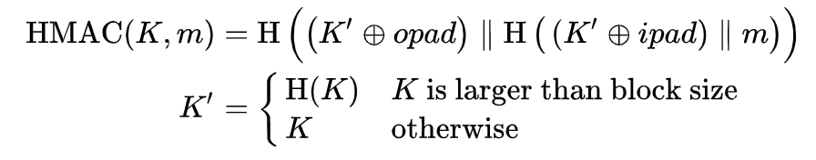

10/17 (will)

despite pushing start time back 15m, will still managed to be late by ~5m.
perhaps this is evidence that prior (minor) battles won are not a ratchet;
prior (minor) victories cannot be counted as present wins. hopefully this was
forgiven by the 1.5hr session. topics included PRF vs. PRP, grading logistics,
meta-learning, and of course, length extension in ps3 problem 4.

# PRPs vs. PRFs

discussion started off with a question about PRFs vs. PRPs. this can definitely
be a confusing topic, so it's good to build an intuition. recall that functions
are not particularly constrained -- they basically say "give me some stuff and
i'll give you some stuff" where the input stuff might look drastically
different from the output stuff. permutations, on the other hand, say "give me
some stuff, and I'll rearrange that stuff to where it'll look like the input
stuff, only scrammbled".

more formally: a **function** may have distinct domain and range, while a
**permutation**'s domain and range are equivalent.

ok, so those are "functions" and "permutations" in the general sense, but in
cryptography the "pseudo-random" part is particularly important for security. a
PR**F** is a pseudo-random **function** and a PR**P** is a pseudo-random
**permutation**. the "pseudo-random" part is operative, but the overall
definitions of "function" and "permutation" still hold.

ideally, a PRF can do whatever it wants (and is _assumed_ to do whatever it
wants). given any input, a PRF will output some string of nonsense that is
(determnistically) indistinguishable from random noise. that's literally its
job -- to take arbitrary input and turn it into (deterministic) noise. a PRP,
on the other hand, has its hands tied -- it can only output the sort of stuff
that you give to it.

note that PRFs are less constrained than PRPs, indeed PRPs are a subset of
PRFs. any PRP is a PRF in a similar way that every square is a rectangle, but
not every rectangle is a square. all PRPs are PRFs, but not all PRFs are PRPs.
the same principle of generality applies.

in the context of this course, we're _instantiating_ PRFs as **hash functions**
and PRPs as **block ciphers**. please note that these cryptographic constructs
are mere _instances_ of their more general "parent" concepts (PRFs and PRPs
respectively).

the notion of "instantiation" is important here -- hash functions have a
restricted output domain (e.g. 32 bytes for SHA256) while general PRFs do not.
and that's ok! hash functions can take infinite input, and still output a
fixed-size output (i.e. the input space is distinct from the output space).

PRPs, on the other hand, will always have the same sizes for input and output.
you can think of PRPs as the most devilish "shell game" you could imagine,
where there's no known way to discern a mapping between the input and output,
even though the same pieces were always on the table the whole time, just
shuffled around. this allows for a key property of cryptographc PRPs --
invertability. in order for us to make sense of a cihpertext (i.e. the ouput of
a PRP duding encryption), we need to be able to invert that ciphertext into a
plaintext (i.e. decryption).

the course will apply these concepts more directly soon.

addendum: i made a note during hours to link to wikipedia's page on universal
hashing, so prioritizing fidelity at the potential expense of relevance here it
is: https://en.wikipedia.org/wiki/Universal_hashing

# Course Project

there were questions around the project, midterm, and grading. we're hoping to
get autograder for the project out within the next week. we'll sound the conch
shell when it lands.

# Miscellaneous

moving on, another topic that came up was how deep to go on this course's
concpets. this is a very fair question, as the rabbit hole goes quite deep in
cryptography. my guidance is: for the purposes of exams, don't feel the need to
go deeper than topics directly covered in lecture and in problem sets. for the
purposes of your curiosity, i cannot discern the depths therein and they may be
bottomless in cryptography -- applied crypto, number theory, compter science,
and much more. my smoll brain is probably not a fruitful oracle for your
questions, but don't hesitate to reach out; i'll try to redirect you to folks
who can answer them if you're curious.

# ps3, problem 4

time for the red meat, i guess.

lecture hasn't yet covered length-extension attacks, but we gave it a go at
providing a cartoon illustration of merkle-daamgard's vulnerability to such.
below is a (cleaned-up) implementation of a trivial hash function "MyHash" that
arithmetically adds (big-endian) the values that are given to it. 

note that HMAC guards against this as its outer hash function call includes the
message digest hash as well as the secret key:



in other words, because `m` is double-encapsulated, the original message's
(inner) hash cannot be extended from the outer hash.

i attempted an illustration of extending a very silly hash function (one that
just increments the byte value of its input by 1). of course, this isn't
directly applicable to extending something like SHA256. the hope is to provide
intuition about how leaking internal hash state can be dangerous.


```python
import typing


class MyHash:
    BLOCK_SIZE: int = 8
    INITIAL_STATE: bytes = bytes([0 for _ in range(BLOCK_SIZE)])

    def __init__(self):
        self.reset()

    def reset(self):
        self.state = self.INITIAL_STATE

    def update(self, data: bytes):
        self.state = (
            int.from_bytes(self.state, "big", signed=False)
            + int.from_bytes(data, "big", signed=False)
        ).to_bytes(self.BLOCK_SIZE, "big")

    # NOTE: the final operation doesn't do any additional scrambles
    def get(self) -> bytes:
        return self.state


def main():
    h1 = MyHash()
    # SECRET INPUT!!!
    h1.update(b"\x01")
    h1.update(b"\x02")  # my secret key is 2! you should not know this!
    h1.update(b"\x00")
    print("h1\t" + str(h1.get()))
    out_hash = bytes(h1.get())  # save off the internal state of the hash
    # ok, i forget (or don't know) all prior input
    h1.reset()
    h2 = MyHash()
    h2.state = out_hash
    h2.update(b"\x04")  # now we'll update the prior digest with malicious data
    print("h2\t" + str(h2.get()))
    # NOTE: while h2 is different, it still incorporates information from h1's
    # computation. notably, it includes data from secret key "\x02", which
    # should not be leaked. there are ways to work around length-extension
    # attacks and still use merkle-daamgard constructions safely, but it's
    # tricky. in a better world (cf. SHA3 and BLAKE3), the finalized hash would
    # _really_ be final, and would not leak information about the internal
    # state of the hash digest at any point in time during its construction.


if __name__ == "__main__":
    main()
```

and the output when run:

```
$ python3 my_hash.py
h1      b'\x00\x00\x00\x00\x00\x00\x00\x03'
h2      b'\x00\x00\x00\x00\x00\x00\x00\x07'
```

for folks who are eager to understand the potential pitfalls of
length-extension, see the "Example" heading of this wikpedia page:

https://en.wikipedia.org/wiki/Length_extension_attack
