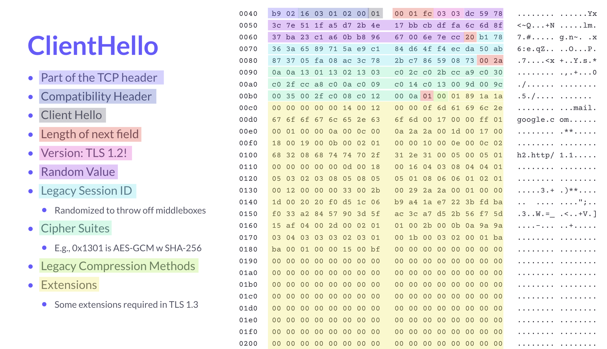
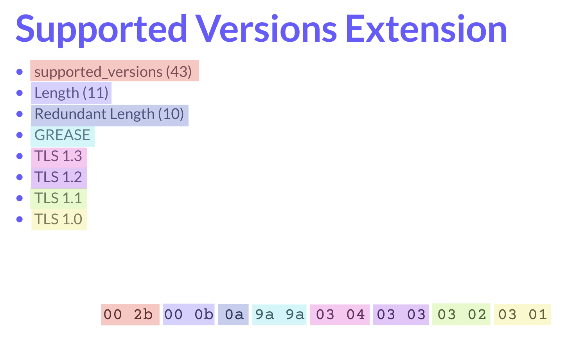
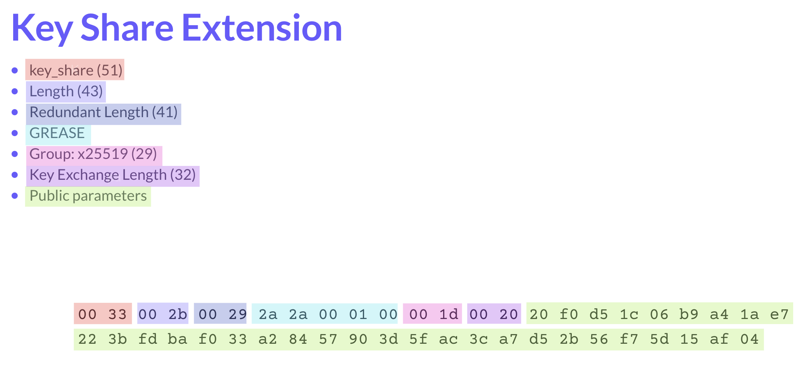

# TLS 1.3 Project

<!-- START doctoc generated TOC please keep comment here to allow auto update -->
<!-- DON'T EDIT THIS SECTION, INSTEAD RE-RUN doctoc TO UPDATE -->

- [Description](#description)
- [Resources](#resources)
- [Specification](#specification)
  - [Values, Messages, and Records](#values-messages-and-records)
    - [Values and Types](#values-and-types)
    - [Type-Length-Value Encoding](#type-length-value-encoding)
    - [Messages](#messages)
    - [Records](#records)
  - [Client: Hello](#client-hello)
  - [Server: Alert](#server-alert)
  - [Server: Hello](#server-hello)
  - [Client: Calculate Handshake Secrets](#client-calculate-handshake-secrets)
  - [Server: Change Cipher Spec](#server-change-cipher-spec)
  - [Server: Encrypted Extensions, Certificate, CertificateVerify, and Finished](#server-encrypted-extensions-certificate-certificateverify-and-finished)
  - [Client: Calculate Server Application Key](#client-calculate-server-application-key)
  - [Client: Change Cipher Spec](#client-change-cipher-spec)
  - [Client: Finished](#client-finished)
  - [Client: Calculate Client Application Key](#client-calculate-client-application-key)
  - [Server: New Session Tickets](#server-new-session-tickets)
  - [Client: HTTP Request](#client-http-request)
  - [Server: HTTP Response](#server-http-response)
  - [Server: Close Notify](#server-close-notify)
- [Scaffolding Problems](#scaffolding-problems)
- [Examples](#examples)
- [Gradescope](#gradescope)
- [Nginx](#nginx)
- [CLI](#cli)

<!-- END doctoc generated TOC please keep comment here to allow auto update -->

## Description

ASCII diagram is worth a thousand words (figure directly from RFC):

```
       Client                                           Server

Key  ^ ClientHello
Exch | + key_share*
     | + signature_algorithms*
     | + psk_key_exchange_modes*
     v + pre_shared_key*       -------->
                                                  ServerHello  ^ Key
                                                 + key_share*  | Exch
                                            + pre_shared_key*  v
                                        {EncryptedExtensions}  ^  Server
                                        {CertificateRequest*}  v  Params
                                               {Certificate*}  ^
                                         {CertificateVerify*}  | Auth
                                                   {Finished}  v
                               <--------  [Application Data*]
     ^ {Certificate*}
Auth | {CertificateVerify*}
     v {Finished}              -------->
       [Application Data]      <------->  [Application Data]

              +  Indicates noteworthy extensions sent in the
                 previously noted message.

              *  Indicates optional or situation-dependent
                 messages/extensions that are not always sent.

              {} Indicates messages protected using keys
                 derived from a [sender]_handshake_traffic_secret.

              [] Indicates messages protected using keys
                 derived from [sender]_application_traffic_secret_N.

               Figure 1: Message Flow for Full TLS Handshake
```

Standardized [a few years ago][1], TLS 1.3 marks a drastic reform of prior TLS
versions. The principle themes of 1.3 are simplification, RTT reduction, and
restricting ciphersuite support in accordance with contemporary cryptographic
best practices. TLS 1.3 simultaneously simplifies the protocol and improves
performance by reducing round trips at the TLS layer from 3 to 2 during the
handshake. This is accomplished by the client sending a "guess" of supported
ciphersuites in the client Hello, along with KeyShare information. If the
client has guessed correctly, the server can utilize the client's KeyShare and
immediately send its own KeyShare and certificate in its server Hello. At this
point, we've only burned one round trip, and the client is ready to send its
Finished message along with its first segment of application data over the
symmetrically encrypted TLS channel!

In this project, we will implement the client side of a restricted TLS 1.3
handshake and a (basic) symmetric session. Students will incrementally build a
client along "checkpoints" in the autograder at each step of the TLS handshake,
ending with a TLS client capable of interacting with real-world endpoints. To
simplify the assignment's implementation, we will restrict the supported
ciphersuite to `TLS_AES_128_GCM_SHA256` using ECDHE with x25519 for key
exchange, 128-bit AES in GCM mode for symmetric encryption, and ECDSA for
signatures. We will not implement [session resumption][32]/stores, [pre-shared
keys][31], [downgrade prevention][30], [key updates][29], or other real-world
concerns that would be required for a practical and real-world secure TLS
implementation.

The client will, however, need to validate the server certificate, checking for
things like expiration, signature validity, etc. The client will also implement
some TLS extensions:

- Supported Versions (required in TLS 1.3)

- Key Share (also required)

- Server Name Indication ("SNI")

  SNI is used to specify which domain a client is attempting to connect to on a server that hosts
  multiple domains (such as a load balancer in a cloud environment). SNI is very
  simple to implement, as it only requires adding an additional field to the
  client Hello message.

- Supported Groups

  Supported groups specifies which groups client supports for the key exchange.
  We will only support x25519 group.

- Supported Signatures

  Supported signatures specifies which signatures client supports for
  certificate validation.

## Resources

- [TLS 1.3 RFC][1]
- [The Illustrated TLS 1.3 Connection][2]
- [A Detailed Look at RFC 8446 (a.k.a. TLS 1.3)][3]
- [online ASN.1 encoder/decoder][6]
- [full handshake test vectors][37]

Diagrams illustrating the format of client Hello message, Supported Versions
Extension, and Key Share Extension:

<details>
<summary>Client Hello</summary>



</details>

<details>
<summary>Supportted Versions</summary>



</details>

<details>
<summary>Key Share</summary>



</details>

## Specification

**NOTE** this section is an attempt to simplify the RFC however IT IS NOT a
substitute to actually checking the RFC. It is ultimately the source of truth
of the TLS1.3 specification. This document describes (at least attempts to)
all critical parts of the TLS tunnel which will be required to complete this
project and links to original RFC sections. Part of the project is reading,
understanding and applying cryptographic/security related documents such as an
RFC.

Side note. This RFC is actually pretty approachable. If you never read these
type of documents before, please do give it a try. There are no dragons here
and no-one will bite you :D. Just the ultimate bragging rights for implementing
TLS which very few people can say they did that :wink:

### Values, Messages, and Records

#### Values and Types

This phase will cover the basic building blocks of TLS as a protocol: _values_,
_messages_, and _records_. First we'll discuss values and their types, followed
by messages composed of those values, and finally records composed of messages.

The most basic building block of TLS is the value. A value is simply a sequence
of bytes whose meaning is defined by its _type_. For instance, as we'll see
below a uint32 and a length-4 byte array are both a sequence of 4 bytes, but
the former represents a single number value, while the latter could represent
any number of entities consisting of 4 bytes. [Section 3 of RFC-8446][14]
defines the RFC's notation for describing value types and their formats:

```
   3. Presentation Language ..........................................19
      3.1. Basic Block Size ..........................................19
      3.2. Miscellaneous .............................................20
      3.3. Numbers ...................................................20
      3.4. Vectors ...................................................20
      3.5. Enumerateds ...............................................21
      3.6. Constructed Types .........................................22
      3.7. Constants .................................................23
      3.8. Variants ..................................................23
```

Of these, we will discuss a few of the "types" used to encode data, namely
numbers and vectors. Enumerateds (analogous to `enum` types in other
languages), constructed types (analogous to `struct` types in other languages),
constants, and variants (analogous to `union` types in other languages) are
also important, but are less salient and novel so we'll cover them implicitly
in the following phases as the need arises.

Number types are fixed-size and given in big-endian (i.e. the leftmost bit is
the most significant bit), with a few of them [defined as][8]:

- `uint8`: unsigned 8-bit integer (like an usigned `char` in C)
- `uint16`: unsigned 16-bit integer
- `uint24`: unsigned 24-bit integer (we won't use this much)
- `uint64`: unsigned 64-bit integer (like an unsigned `long` in C)

[Vector types][9] can be broken down into two sub-types: fixed-length and
variable-length. Fixed-length vectors have a constant length defined in the
RFC, and as such don't explicitly encode this length "on-the-wire".
Variable-length vectors, on the other hand, encode the length of the byte
vector as a "prefix" given before the vector contents. The length of this
prefix is determined by the max possible length of the vector as defined in the
RFC. For example, a variable-length vector with max length of 2^14 will have a
length prefix of 2 bytes, as 2 bytes are required to represent that maximum
potential length. 2^14 is 16,384 in decimal and `0x4000` in hex, which occupies
two bytes).

Some examples of number and vector types:

- a 8-bit integer with a value decimal 1 is encoded as `0x01`
- a 32-bit integer with a value decimal 19 is encoded as `0x00000013`
- a 0-byte variable-length vector is encoded as `0x00`
- a 1-byte variable-length vector with max byte as the value is encoded as
  `0x01ff`
- a 4-byte variable-length vector where each byte is a subsequent power of 2 is
  encoded as `0x0400010204`
- a 6-byte fixed-length vector of incrementing byte values starting at `01` is
  encoded as `0x010203040506`
  - note that the length is **not encoded** in fixed-length vectors

#### Type-Length-Value Encoding

[Type-length-value ("TLV") encoding][35] is a class of encoding schemes where
data are defined as logical "tuples" consisting of:

1. type
1. length
1. value

This sub-section won't spend much time discussing these, as the [wikipedia
page][35] already does a very good job of this, and yes, because they _really
are that simple_ as long as the byte-length of type and length are themselves
well-defined. We will see and implement many instances of TLV encoding (record
encoding, handshake message encoding, extension encoding, and on and on), so be
sure you're familiar with the general idea.

#### Messages

Logical steps in the TLS protocol are captured by _messages_. Messages are
composed of one or more values that are interpreted differently depending on
the message type. The first message type we will see are _handshake messages_.
The first 4 bytes of these messages constitute the _handshake header_:

1. message type (one byte)
1. message size (3 bytes)

Subsequent bytes comprise the handshake message itself. The message's format
varies by type, as we'll see in Phases below. [Section 4 of RFC-8446][34]
defines the following handshake message types as an enumerated with their
decimal values in parenthesis:

```
client_hello(1),
server_hello(2),
new_session_ticket(4),
end_of_early_data(5),
encrypted_extensions(8),
certificate(11),
certificate_request(13),
certificate_verify(15),
finished(20),
key_update(24),
message_hash(254),
```

We will only consider the following messages, with their value given in hex:

- `client_hello`: `0x01`
- `server_hello`: `0x02`
- `encryptetd_extensions: 0x08`
- `certificate`: `0x0b`
- `certificate_verify`: `0x0f`
- `finished`: `0x14`
- `new_session_ticket: 0x04`

We'll cover the format of each of these in subsequent phases.

#### Records

Just as messages contain values, records contain messages. RFC-8446 defines a
sub-protocol that it refers to as the ["record protocol"][33]. TLS _messages_
are encoded into _records_ for sending across a transport protocol (usually
TCP). This abstraction allows implementations to send message _fragments_
across multiple records. The record layer also provides a convenient
abstraction for encrypting some handshake messages, as the record header
metadata is given in plaintext, and the encrypted message content can be
treated opaquely at the _record layer_, before being decrypted and being
operated up on at the _message layer_.

For simplicity's sake, we will consider messages and headers as 1:1 (i.e. 1
message per record, and 1 record per message), but we still need to implement
the record protocol/layer in order to interoperate with real-world TLSv1.3
implementations.

Like handshake messages, records also have headers. Headers allow parsers
to modify their behavior based on the type, size, and protocol version of
records. Record headers consist of 5 bytes, and are formatted like so:

1. record type (1 byte)
1. legacy protocol version (constant value of `0x0303` except in Client Hello `0x0301`, 2 bytes)
1. record size (2 bytes)

Section [5.1 of RFC-8446][27] defines record types (again, as an enum with
base-10 value in parentheses):

```
invalid(0),
change_cipher_spec(20),
alert(21),
handshake(22),
application_data(23),
```

We will only consider the following messages, with their value given in hex:

- `alert`: `0x15`
- `handshake`: `0x16`
- `application_data`: `0x17`

The record type of all (unencrypted) handshake records is `0x16`. While
encrypted handshake messages are still handshake messages at the _message
layer_, they have a different type ("application data", `0x17`) at the
_application layer_. This is because at the record layer, encrypted message
contents are encrypted (i.e. opaque) and must be decrypted before the message
type can be determined and the message can be parsed.

We'll also need to maintain running counters of records read and records
written during a connection, as described in [section 5.3 of RFC-8446][28]:

> A 64-bit sequence number is maintained separately for reading and
> writing records. The appropriate sequence number is incremented by
> one after reading or writing each record. Each sequence number is
> set to zero at the beginning of a connection and whenever the key is
> changed; the first record transmitted under a particular traffic key
> MUST use sequence number 0.

These counters will be used as our record nonces for generating unique
per-record IVs for record encryption and decryption later on in the handshake.
The record layer is fully described in [section 5.1 of RFC-8446][27]. We won't
see encrypted handshake messages until after hellos, so we will defer diving into
the [record payload protection][22] (i.e. `application_data`-type record
encryption/decryption) scheme until then.

### Client: Hello

In the first phase of the handshake, the client presents a client Hello message
to the server. The format of the client Hello is described [in the RFC][4].
Note that a number of the mandatory fields are unused in the protocol, but are
required for backwards compatibility of the protocol. The client Hello for this
project wil consist of the following required fields (not including record and
message headers), in order:

1. client version. For example:
   ```
   TLS12                       0000: 03 03
   ```
1. client random (32 bytes). For example:
   ```
   random                      0000: 8b 44 79 1f bf 08 a5 da 55 eb c5 46 b3 34 18 20
                               0016: 66 e2 f3 5c 02 c2 41 c1 37 3a 11 2b 4c b0 c2 2f
   ```
1. unused legacy session ID vector (must be non-empty value). For example:
   ```
   length                      0000: 14
   session id                  0000: de f7 4c 1f 06 01 a3 e5 c0 e5 7b 47 d9 93 af 69
                               0016: 4e 2e ba 02
   ```
1. supported cipher suites vector. For example:

   ```
   length                      0000: 00 02
   TLS_AES_128_GCM_SHA256      0000: 13 01
   ```

   - NOTE: that for simplicity, the project will only support a single cipher
     suite, `TLS_AES_128_GCM_SHA256` (`0x1301`).

1. unused legacy compression methods. For example:
   ```
   length                      0000: 01
   NULL                        0000: 00
   ```
1. extensions vector. For example:

   ```
   length                      0000: 00 5b
   <Extension>
   ...
   </Extension>
   ...
   ```

Each extension is encoded as follows:

1. extension type (2 bytes). For example:
   ```
   SUPPORTED_VERSIONS          0000: 00 2b
   ```
1. extension data length (2 bytes). For example:
   ```
   length                      0000: 00 03
   ```
1. extension data (given by RFC structure definition). For supported versions extension:
   ```
   length                      0000: 02
   TLS13                       0000: 03 04
   ```

The client Hello must also include the following extensions in the format
described [in the RFC][5]:

- [supported versions][10]. For example:
  ```
  <Extension>
  SUPPORTED_VERSIONS          0000: 00 2b
  length                      0000: 00 03
  length                      0000: 02
  TLS13                       0000: 03 04
  </Extension>
  ```
- [server name][14]. For example:
  ```
  <Extension>
  SERVER_NAME                 0000: 00 00
  length                      0000: 00 16
  length                      0000: 00 14
  HOST_NAME                   0000: 00
  length                      0000: 00 11
  hostname                    0000: 63 73 2d 67 79 36 39 30 33 2e 6e 79 75 2e 65 64
                              0016: 75
  </Extension>
  ```
- [supported groups][11]. For example:
  ```
  <Extension>
  SUPPORTED_GROUPS            0000: 00 0a
  length                      0000: 00 04
  length                      0000: 00 02
  X25519                      0000: 00 1d
  </Extension>
  ```
  - NOTE: for simplicity, the project will only support a single curve
    [x25519][12].
- [key share][13]. For example:
  ```
  <Extension>
  KEY_SHARE                   0000: 00 33
  length                      0000: 00 26
  length                      0000: 00 24
  X25519                      0000: 00 1d
  length                      0000: 00 20
  x25519 public key           0000: 0e 2b 35 f1 ae 56 26 d9 b2 2c c5 ed 54 01 65 67
                              0016: a1 0e 7e c8 c3 e0 e3 a3 20 c6 9f 50 73 57 9c 77
  </Extension>
  ```
- [signature algorithms][38]. For example:
  ```
  <Extension>
  SIGNATURE_ALGORITHMS        0000: 00 0d
  length                      0000: 00 04
  length                      0000: 00 02
  ECDSA_SECP256R1_SHA256      0000: 04 03
  </Extension>
  ```
  - NOTE: for simplicity, the projject will only support a single ECDSA curve

<details>
<summary>Putting it all together. Full annotated Client Hello record:</summary>

```
<Record>
HANDSHAKE                   0000: 16
TLS10                       0000: 03 01
length                      0000: 00 9e
CLIENT_HELLO                0000: 01
length                      0000: 00 00 9a
TLS12                       0000: 03 03
random                      0000: 8b 44 79 1f bf 08 a5 da 55 eb c5 46 b3 34 18 20
                            0016: 66 e2 f3 5c 02 c2 41 c1 37 3a 11 2b 4c b0 c2 2f
length                      0000: 14
session id                  0000: de f7 4c 1f 06 01 a3 e5 c0 e5 7b 47 d9 93 af 69
                            0016: 4e 2e ba 02
length                      0000: 00 02
TLS_AES_128_GCM_SHA256      0000: 13 01
length                      0000: 01
NULL                        0000: 00
length                      0000: 00 5b
<Extension>
SUPPORTED_VERSIONS          0000: 00 2b
length                      0000: 00 03
length                      0000: 02
TLS13                       0000: 03 04
</Extension>
<Extension>
SUPPORTED_GROUPS            0000: 00 0a
length                      0000: 00 04
length                      0000: 00 02
X25519                      0000: 00 1d
</Extension>
<Extension>
SIGNATURE_ALGORITHMS        0000: 00 0d
length                      0000: 00 04
length                      0000: 00 02
ECDSA_SECP256R1_SHA256      0000: 04 03
</Extension>
<Extension>
KEY_SHARE                   0000: 00 33
length                      0000: 00 26
length                      0000: 00 24
X25519                      0000: 00 1d
length                      0000: 00 20
x25519 public key           0000: 0e 2b 35 f1 ae 56 26 d9 b2 2c c5 ed 54 01 65 67
                            0016: a1 0e 7e c8 c3 e0 e3 a3 20 c6 9f 50 73 57 9c 77
</Extension>
<Extension>
SERVER_NAME                 0000: 00 00
length                      0000: 00 16
length                      0000: 00 14
HOST_NAME                   0000: 00
length                      0000: 00 11
hostname                    0000: 63 73 2d 67 79 36 39 30 33 2e 6e 79 75 2e 65 64
                            0016: 75
</Extension>
</Record>
```

</details>

### Server: Alert

Now that server has received some data from the client, at any point of the TLS
connection, server may send back to the client an alert message. Alert messages
are very simply since they only have an alert level and a description enum
values. For example:

```
<Record>
ALERT                       0000: 15
TLS12                       0000: 03 03
length                      0000: 00 02
FATAL                       0000: 02
CLOSE_NOTIFY                0000: 14
</Record>
```

You should handle alert messages, especially if they are of `FATAL` level.
In that case something bad happened and TLS tunnel should be aborted.

NOTE that alert messages can come in plaintext before any keys have
been exchanged or could be encrypted after key schedule either for
handshake or application data have been established.

### Server: Hello

In the next step of the handshake, the server sends its response(s) back to the
client - Server Hello message, other handshake messages configuring crypto
context for the TLS channel as well as validating server integrity/authenticity
and finally wrapping up with Finished message.

The [server Hello message][15] is given in the following format (not including
record and message headers):

1. unused legacy server version. For example:
   ```
   TLS12                       0000: 03 03
   ```
1. server random (32 bytes)
   ```
   random                      0000: ee ad ba de 7c f4 f0 64 b3 af 02 23 60 0f 43 14
                               0016: 7c 9c a8 31 2a c2 80 fc e6 75 cb a4 6d bf 46 7c
   ```
1. unused legacy session ID vector echo (echoes whatever client sent). For example:
   ```
   length                      0000: 14
   session id                  0000: de f7 4c 1f 06 01 a3 e5 c0 e5 7b 47 d9 93 af 69
                               0016: 4e 2e ba 02
   ```
1. cipher suite selection (constant value [`0x1301`][7]). For example:
   ```
   TLS_AES_128_GCM_SHA256      0000: 13 01
   ```
   - NOTE: this is the server's _selection_, so it's a singular value rather
     than a list as in the client Hello.
1. unused legacy compression method selection (constant value `0x00`). For example:
   ```
   NULL                        0000: 00
   ```
   - NOTE: this is also a server selection so it is a single value.
1. extensions vector. For example:
   ```
   length                      0000: 00 2e
   <Extension>
   ...
   </Extension>
   ...
   ```

While the RFC requires special treatment by the client if it [encounters the
following value of Server Random][15], to keep things simple we will not
require this behavior:

> For reasons of backward compatibility with middleboxes (see
> Appendix D.4), the HelloRetryRequest message uses the same structure
> as the server Hello, but with Random set to the special value of the
> SHA-256 of "HelloRetryRequest":
>
>     CF 21 AD 74 E5 9A 61 11 BE 1D 8C 02 1E 65 B8 91
>     C2 A2 11 16 7A BB 8C 5E 07 9E 09 E2 C8 A8 33 9C
>
> Upon receiving a message with type server_hello, implementations MUST
> first examine the Random value and, if it matches this value, process
> it as described in Section 4.1.4).

The server Hello must include the following extensions in the format described
[in the RFC][15]:

1. [supported versions][10] (constant value of `0x002b00020304`, 6 bytes total). For example:
   ```
   <Extension>
   SUPPORTED_VERSIONS          0000: 00 2b
   length                      0000: 00 02
   TLS13                       0000: 03 04
   </Extension>
   ```
   - NOTE: this extension is a list in client Hello, but is a single value
     in server Hello as it indicates the server's version selection.
1. [key share][13] (42 bytes). For example:
   ```
   <Extension>
   KEY_SHARE                   0000: 00 33
   length                      0000: 00 24
   X25519                      0000: 00 1d
   length                      0000: 00 20
   x25519 public key           0000: 86 ed 63 87 0d 3b 75 ad 7b 0a fe 10 fd 04 d1 54
                               0016: 03 19 21 d1 39 4f 69 7d c1 c3 77 88 38 f4 ad 33
   </Extension>
   ```

<details>
<summary>Putting it all together. Full annotated Server Hello record:</summary>

```
<Record>
HANDSHAKE                   0000: 16
TLS12                       0000: 03 03
length                      0000: 00 6e
SERVER_HELLO                0000: 02
length                      0000: 00 00 6a
TLS12                       0000: 03 03
random                      0000: ee ad ba de 7c f4 f0 64 b3 af 02 23 60 0f 43 14
                            0016: 7c 9c a8 31 2a c2 80 fc e6 75 cb a4 6d bf 46 7c
length                      0000: 14
session id                  0000: de f7 4c 1f 06 01 a3 e5 c0 e5 7b 47 d9 93 af 69
                            0016: 4e 2e ba 02
TLS_AES_128_GCM_SHA256      0000: 13 01
NULL                        0000: 00
length                      0000: 00 2e
<Extension>
SUPPORTED_VERSIONS          0000: 00 2b
length                      0000: 00 02
TLS13                       0000: 03 04
</Extension>
<Extension>
KEY_SHARE                   0000: 00 33
length                      0000: 00 24
X25519                      0000: 00 1d
length                      0000: 00 20
x25519 public key           0000: 86 ed 63 87 0d 3b 75 ad 7b 0a fe 10 fd 04 d1 54
                            0016: 03 19 21 d1 39 4f 69 7d c1 c3 77 88 38 f4 ad 33
</Extension>
</Record>
```

</details>

### Client: Calculate Handshake Secrets

Now that the client has generated its own keypair and has received that of the
server, it's ready to calculate the handshake secrets. Section 4.2.8.2 of the RFC
[describes][16] how to interpret the keyshare's public key field for ECDHE
under X25519:

> For X25519 and X448, the contents of the public value are the byte
> string inputs and outputs of the corresponding functions defined in
> [RFC7748]: 32 bytes for X25519 and 56 bytes for X448.

And RFC-7748 [describes][17] how we can use this public key value:

> Using their generated values and the received input, Alice computes
> X25519(a, K_B) and Bob computes X25519(b, K_A).
>
> Both now share K = X25519(a, X25519(b, 9)) = X25519(b, X25519(a, 9))
> as a shared secret. Both MAY check, without leaking extra
> information about the value of K, whether K is the all-zero value and
> abort if so (see below). Alice and Bob can then use a key-derivation
> function that includes K, K_A, and K_B to derive a symmetric key.

While it would be important to check for the zero-value in real-world
implementations, we won't require that here.

We then use the shared secret (referred to as `K` above) and HKDF (as described
[in RFC 5869][19] and [on wikipedia][20]) to compute the Handshake Secret (used
to derive symmetric keys for encrypted portions of the handshake) and the
Master Secret (used to derive symmetric keys for application traffic) via the
[following scheme][18]:

<details>
<summary>Key Schedule</summary>

```
01             0
02             |
03             v
04   PSK ->  HKDF-Extract = Early Secret
05             |
06             +-----> Derive-Secret(., "ext binder" | "res binder", "")
07             |                     = binder_key
08             |
09             +-----> Derive-Secret(., "c e traffic", client Hello)
10             |                     = client_early_traffic_secret
11             |
12             +-----> Derive-Secret(., "e exp master", client Hello)
13             |                     = early_exporter_master_secret
14             v
15       Derive-Secret(., "derived", "")
16             |
17             v
18   (EC)DHE -> HKDF-Extract = Handshake Secret
19             |
20             +-----> Derive-Secret(., "c hs traffic",
21             |                     client Hello...server Hello)
22             |                     = client_handshake_traffic_secret
23             |
24             +-----> Derive-Secret(., "s hs traffic",
25             |                     client Hello...server Hello)
26             |                     = server_handshake_traffic_secret
27             v
28       Derive-Secret(., "derived", "")
29             |
30             v
31   0 -> HKDF-Extract = Master Secret
32             |
33             +-----> Derive-Secret(., "c ap traffic",
34             |                     client Hello...server Finished)
35             |                     = client_application_traffic_secret_0
36             |
37             +-----> Derive-Secret(., "s ap traffic",
38             |                     client Hello...server Finished)
39             |                     = server_application_traffic_secret_0
40             |
41             +-----> Derive-Secret(., "exp master",
42             |                     client Hello...server Finished)
43             |                     = exporter_master_secret
44             |
45             +-----> Derive-Secret(., "res master",
46                                   client Hello...client Finished)
47                                   = resumption_master_secret
```

</details>

Note that since we're not implementing the Pre-Shared Key (PSK) extension,
we'll need to follow the guidance around using the 0 PSK as described
[here][17]:

> if PSK is not in use, Early Secret will still be HKDF-Extract(0, 0) ... if
> no PSK is selected, it will then need to compute the Early Secret
> corresponding to the zero PSK.

This ends up working in our favor, however, because it means that we can
precompute the value on line 15 that's fed into HKDF as a seed on line 18. It
is safe to precompute this, as it is invariant over all handshakes that do not
use a PSK. This means that computing the Handshake and Master secrets becomes
as simple as:

```
Handshake Secret = HKDF-Extract(Derive-Secret(HKDF-Extract(0, 0), "derived", ""), K)
Master Secret = HKDF-Extract(Derive-Secret(Handshake Secret, "derived", ""), 0)
```

Where `K` is the shared secret established via ECDH.

`HKDF-Extract` is defined [like so][19]:

<details>
<summary>HKDF-Extract</summary>

```
HKDF-Extract(salt, IKM) -> PRK

Options:
  Hash     a hash function; HashLen denotes the length of the
           hash function output in octets

Inputs:
  salt     optional salt value (a non-secret random value);
           if not provided, it is set to a string of HashLen zeros.
  IKM      input keying material
```

</details>

`Derive-Secret` is defined [like so][18]:

<details>
<summary>Derive-Secret</summary>

```
Derive-Secret(Secret, Label, Messages) =
    HKDF-Expand-Label(Secret, Label,
                      Transcript-Hash(Messages), Hash.length)

HKDF-Expand-Label(Secret, Label, Context, Length) =
    HKDF-Expand(Secret, HkdfLabel, Length)

Where HkdfLabel is specified as:

struct {
   uint16 length = Length;
   opaque label<7..255> = "tls13 " + Label;
   opaque context<0..255> = Context;
} HkdfLabel;
```

</details>

`HKDF-Expand` is also defined in [RFC 5869][19] as:

<details>
<summary>HKDF-Expand</summary>

```
HKDF-Expand(PRK, info, L) -> OKM

Options:
  Hash     a hash function; HashLen denotes the length of the
           hash function output in octets

Inputs:
  PRK      a pseudorandom key of at least HashLen octets
           (usually, the output from the extract step)
  info     optional context and application specific information
           (can be a zero-length string)
  L        length of output keying material in octets
           (<= 255*HashLen)
```

</details>

In particular, note how the HkdfLabel is constructed from the Label, Context,
and Length inputs to `HKDF-Expand-Label`. This will be needed later.

Transcript-Hash is defined [like so][21] (`||` denotes concatenation):

```
Transcript-Hash(M1, M2, ... Mn) = Hash(M1 || M2 || ... || Mn)
```

Note that, in general, when we're taking Message hashes, we're [_excluding_ the
Record headers but _including_ the Message headers (as well as the Message
contents)][36]:

> This value is computed by hashing the concatenation of each included
> handshake message, including the handshake message header carrying the
> handshake message type and length fields, but not including record layer
> headers.
> ...
> For concreteness, the transcript hash is always taken from the
> following sequence of handshake messages, starting at the first
> client Hello and including only those messages that were sent:
> client Hello, HelloRetryRequest, client Hello, server Hello,
> EncryptedExtensions, server CertificateRequest, server Certificate,
> server CertificateVerify, server Finished, EndOfEarlyData, client
> Certificate, client CertificateVerify, client Finished.

Additionally, note that for the purposes of this project we will not be
sending/recieving any of:

- HelloRetryRequest
- second client Hello
- server CertificateRequest
- client Certificate
- client CertificateVerify

Eventually we will need to compute all of these keys:

```
22             |                     = client_handshake_traffic_secret
26             |                     = server_handshake_traffic_secret
35             |                     = client_application_traffic_secret_0
39             |                     = server_application_traffic_secret_0
```

At this point in the handshake, only the client Hello and server Hello will be
available for the transcript. Therefore at this stage we can only compute
handshake traffic secrets as we can only compute transcript hash of the hellos.
Only after we receive and decrypt subsequent server handshake message,
send client finished message, we will be able to compute rest of the
application traffic keys. The algorithm for computing them will be the same
except the transcript hash to compute them will include more handshake messages.

### Server: Change Cipher Spec

Now that both sides have exchanged their respective Hello messages and key
shares, the rest of the handshake can be encrypted using keys derived from the
shared secret. Server indicates that with a change cipher spec message.
The format of it as follows:

- number `1` indicating after this message everything is encrypted. For example:
  ```
  data                        0000: 01
  ```

### Server: Encrypted Extensions, Certificate, CertificateVerify, and Finished

Unlike preceding plaintext handshake records, encrypted handshake
messages have a record type of "application data" (`0x17`). Encrypted
application data records, described in [section 5.2 of RFC-8446][22], have the
following format (this includes the record header):

- record type. For example:
  ```
  APPLICATION_DATA            0000: 17
  ```
- unused legacy protocol version. For example:
  ```
  TLS12                       0000: 03 03
  ```
- record data length. For example:
  ```
  length                      0000: 00 1b
  ```
- encrypted application data ciphertext (variable length). For example:
  ```
  data                        0000: 66 c7 fa 63 10 e2 db d9 7e 5f 7f 42 74 ed 2f 33
                              0016: 94 7b 5c 01 ca f7 3f 49 ae 99 b8
  ```
  Note that the ciphertext will include the authentication tag from the
  AE (authenticated encryption) cipher such as AES-GCM.

For each of this phase's messages, we'll need to decrypt the records in order
to parse the messages and validate their contents. Per our negotiated
ciphersuite, these records are encrypted using 128-bit AES GCM, so we know that
we'll need a master key and an IV. The calculation of these inputs is partially
described in [section 7.3 of RFC-8446][23]; you may recognize our old friend
`HKDF-Expand-Label`:

```
   [sender]_write_key = HKDF-Expand-Label(Secret, "key", "", key_length)
   [sender]_write_iv  = HKDF-Expand-Label(Secret, "iv", "", iv_length)
```

Because this is 128-bit AES, the key and IV lengths are both 128 bits (i.e. 16
bytes). However, recall that **IVs cannot be reused** across records without
compromising the security of the symmetric encryption. So, for each encrypted
record, we need to modify our IV using a nonce as described in [section 5.3 of
RFC-8446][28]:

> The per-record nonce for the AEAD construction is formed as follows:
>
> 1.  The 64-bit record sequence number is encoded in network byte
>     order and padded to the left with zeros to iv_length.
>
> 2.  The padded sequence number is XORed with either the static
>     client_write_iv or server_write_iv (depending on the role).
>
> The resulting quantity (of length iv_length) is used as the
> per-record nonce.

We feed nonce into the AES cipher as an IV to decrypt records. Note that the
sequence number must be incremented after each record in the handshake is sent
or received.

So, what do we use for the `Secret` passed into `HKDF-Expand-Label`?
Recall this excerpt from the graph in [section 7.1 of RFC-8446][18]:

```
(EC)DHE -> HKDF-Extract = Handshake Secret
         |
         +-----> Derive-Secret(., "c hs traffic",
         |                     client Hello...server Hello)
         |                     = client_handshake_traffic_secret
         |
         +-----> Derive-Secret(., "s hs traffic",
         |                     client Hello...server Hello)
         |                     = server_handshake_traffic_secret
```

For decrypting encrypted records on the client side during the handshake, we
will generate keys using the server's derived secret, expanded with label
"s hs traffic". Note that the handshake keys and IVs are different for client
and server. In order to encrypt/decrypt both sides of the conversation, both
client and server will need to compute each others' symmetric cipher inputs.
This is possible because they both derive these secrets using the initial
shared secret courtesy of Diffie-Hellman, from which the common handshake
secret is derived, from which in turn the client/server-specific secrets are
derived. The server uses the server secret to encrypt records and the client
uses the client secret to encrypt records, so for decryption each party needs
to use the other's secret to derive the symmetric cipher inputs for decryption.

Once the client has established the server's handshake key and IV (using the
latter to calculate the per-record nonce), they can pass the key, nonce,
ciphertext (including authentication tag) to a cryptography library to perform AES
decryption (and validation of the auth tag against the ciphertext, ensuring
integrity).

The decrypted plaintext is going to contain decrypted TLS record message.
Note that the decrypted message can be of any record type - handshake,
application data, etc. As such the plaintext will contain an indication of
the type of the record which was originally encrypted. That is described by
[`TLSInnerPlaintext`][22] object. Practically the last byte of the inner
plaintext will indicate the `ContentType` of the message. For encrypted
extensions, server certificate, certificate verify and finished messages the
type is going to be a handshake message. If you receive any other type such as
alert, something went wrong and you should not proceed with the handshake.

Now it's time to parse and validate the server's messages! As with prior
sections detailing message format, we will elide record and message headers
below.

Before server verification messages, the server will send [encrypted extensions][39] handshake message.
As per RFC:

> The EncryptedExtensions message contains extensions that can be
> protected, i.e., any which are not needed to establish the
> cryptographic context but which are not associated with individual
> certificates.

The format of the message is as follows (excluding headers):

- handshake type. For example:
  ```
  ENCRYPTED_EXTENSIONS        0000: 08
  ```
- length pf the handshake fragment. For example:
  ```
  length                      0000: 00 00 06
  ```
- length of the list of extensions. For example:
  ```
  length                      0000: 00 04
  ```
- list of extensions. For example:
  ```
  SERVER_NAME                 0000: 00 00
  SERVER_NAME                 0000: 00 00
  ```
  Note that it could contain duplicate extension names.

Then you should receive the server verification messages.
Server Certificate message is given in the following format:

- request context vector. Usually empty. For example:
  ```
  length                      0000: 00
  certificate context
  ```
- certificate list vector length. For example:
  ```
  length                      0000: 00 07 5e
  ```
- certificate `i` length. For example:
  ```
  length                      0000: 00 02 cb
  ```
- certificate `i` data. For example:
  ```
  x509 certificate            0000: 30 82 02 c7 30 82 01 af a0 03 02 01 02 02 14 45
                              0016: d2 12 7f 3d 2b a9 4c 95 4c b7 3a ef df b7 4c 11
                              0032: 63 b1 c0 30 0d 06 09 2a 86 48 86 f7 0d 01 01 0b
                              0048: 05 00 30 3c 31 0b 30 09 06 03 55 04 06 13 02 55
                              ...
  ```
- certificate `i` extensions. Usually empty. For example:
  ```
  length                      0000: 00 00
  ```

NOTE: the bytes representing each certificate are presented in a format we
haven't seen yet in this assignment: x509 encoded in ASN.1 DER. This steaming
bowl of alphabet soup is actually surprisingly simple (well, DER is relatively
simple type-length-value similar to TLS record encoding, but x509 is a bit more
intricate); feel free to use a library to parse it.

After parsing the certificate, we will need to check the following attributes
of the cert to determine whether the cert is valid:

1. cert is temporally valid (i.e. current time is after Not Before and before
   Not After)
1. Validate hostname. If certificate has SNI, use that. Otherwise fallback
   to certificate Common Name for hostname validation.
1. the Certificate trust chain is valid per the trusted CA public key cert
   inputted at the top-level of the project. we'll cover walking this trust
   chain in greater detail below.

The CertificateVerify message is used to tie the identity attested in the
certificate to to the server. Because TLS 1.3 servers compute new ephemeral
keys for each Diffie-Hellman key exchange, those keys cannot be used by the
client to authenticate the server's ownership of the presented certificate
(which is signed by a long-lived private key). The server creates the
CertificateVerify message by signing a transcript hash of the handshake with
the certificate's private key. To authenticate the server's ownership of the
cert's private key, the client verifies this signature using the public key in
the presented certificate.

Note that the signature includes more bits in addition to the transcript
hash. See RFC for exactly what to to prepend the transcript hash with
in order to validate the signature correctly.

The CertificateVerify message is given in the following format:

- signature type `0x0403` [for `ecdsa_secp256r1_sha256`][26]. For example:
  ```
  ECDSA_SECP256R1_SHA256      0000: 04 03
  ```
- signature length. For example:
  ```
  length                      0000: 00 47
  ```
- signature data. For example:
  ```
  signature                   0000: 30 45 02 21 00 8d 9c 78 fa f0 9f e8 f0 40 1c a1
                              0016: 2a 16 89 cd be 02 02 e9 7c 64 67 ec ae 45 9d 94
                              0032: 79 dc dd a1 4f 02 20 7e bf 8e c1 4c c5 14 69 92
                              0048: 29 de 91 85 4b 27 fb 1c f2 3b 90 83 5b 58 72 4f
                              0064: 0f b0 45 0d b4 72 6b
  ```

The server Finished message is used by the server to tell the client that it
has sent all of its handshake messages, and that if the client agrees on an
offered `Transcript-Hash` of handshake messages, the symmetric session has been
established and application data can be transmitted bilaterally.

The Finished messge has a single field, `verify_data`. [Section 4.4.4 of
RFC-8446][23] describes how this value is calculated:

```
finished_key =
  HKDF-Expand-Label(BaseKey, "finished", "", Hash.length)
...
verify_data =
  HMAC(finished_key,
       Transcript-Hash(Handshake Context,
                       Certificate*, CertificateVerify*))
```

And [section 4.4 of RFC-8446][25] describes how `BaseKey` for server Finished
is determined:

```
The following table defines the Handshake Context and MAC Base Key
for each scenario:

+-----------+-------------------------+-----------------------------+
| Mode      | Handshake Context       | Base Key                    |
+-----------+-------------------------+-----------------------------+
| Server    | ClientHello ... later   | server_handshake_traffic_   |
|           | of EncryptedExtensions/ | secret                      |
|           | CertificateRequest      |                             |
```

We use the server handshake secret as the `BaseKey`. Recall that we derived
this secret earlier. Upon receiving the server Finished message, the client
needs to determine whether it is valid. It can do this by independently
computing what it believes to be the correct server Finished transcript hash,
computing HMAC over that transcript using the server's handshake secret (as
above), and comparing its expected server Finished against the actual server
Finished. If the two don't match, the server Finished is considered invalid and
the connection is aborted.

To guide implementation of this running-hash-over-context (which comes up many
times during the handshake), recall this excerpt from [section 4.4.1 of
RFC-8446][21]:

> In general, implementations can implement the transcript by keeping a
> running transcript hash value based on the negotiated hash. Note,
> however, that subsequent post-handshake authentications do not
> include each other, just the messages through the end of the main
> handshake.

The server Finished message is given in the following format:

- verify data (size of HMAC-SHA256 output). For example:
  ```
  verify data                 0000: b2 0e e2 14 50 95 ab 44 d3 c3 ba 59 4d ce 7d 64
                              0016: 51 2f 8e 56 71 66 b9 35 e5 5c c2 c7 0c 9b 7e fb
  ```

### Client: Calculate Server Application Key

Now that server has send to the client finished message, the client can
calculate server application traffic key:

```
37             +-----> Derive-Secret(., "s ap traffic",
38             |                     client Hello...server Finished)
39             |                     = server_application_traffic_secret_0
```

The method for calculating this key is the same as for handshake except
it uses a different transcript hash which will include the all handshake
messages seen so far including server finished message. See above for
more specifics how to calculate this key.

All subsequent messages from the server will be encrypted with this application
traffic key. Note that server and client keys use independent IV counter and
server counter will start at 0 from this point.

### Client: Change Cipher Spec

Similarly as with server switching to encrypted messages, client also needs to
send an indicator subsequent messages will be encrypted. The structure of
the message is identical to server change cipher spec. See above for example.

### Client: Finished

The client Finished message performs a similar function as server Finished --
it gives the server an authentic digest of the client's view of the handshake,
and allows the server to decide whether that digest matches expectation. The
server will compute an expected client Finished, and abort the handshake if the
actual client Finished differs from its expectations.

The client's `verify_data` is computed in the same way as the server's,
described in [Section 4.4.4 of RFC-8446][23]:

```
finished_key =
  HKDF-Expand-Label(BaseKey, "finished", "", Hash.length)
...
verify_data =
  HMAC(finished_key,
       Transcript-Hash(Handshake Context,
                       Certificate*, CertificateVerify*))
```

The only differences between client and server Finished messages are the
handshake context and which `BaseKey` is used to derive the HMAC's
`finished_key`. As before, the context and `BaseKey` are defined in the table
from [section 4.4 of RFC-8446][25]:

```
The following table defines the Handshake Context and MAC Base Key
for each scenario:

+-----------+-------------------------+-----------------------------+
| Mode      | Handshake Context       | Base Key                    |
+-----------+-------------------------+-----------------------------+
...
| Client    | ClientHello ... later   | client_handshake_traffic_   |
|           | of server               | secret                      |
|           | Finished/EndOfEarlyData |                             |
```

The client Finished message should be given in the following format:

- verify data (size of HMAC-SHA256 output, 32 bytes)
  ```
  verify data                 0000: 19 11 47 ed 22 c0 36 cf 7f fe ae 88 98 3b 78 4d
                              0016: 05 61 8f b0 c9 8a 58 5a 74 e8 74 52 b1 bf 70 4d
  ```

### Client: Calculate Client Application Key

Now that the client also sent its finished message, the client can
calculate its application traffic key:

```
33             +-----> Derive-Secret(., "c ap traffic",
34             |                     client Hello...server Finished)
35             |                     = client_application_traffic_secret_0
```

The method for calculating this key is the same as for handshake except
it uses a different transcript hash which will include the all handshake
messages seen so far including server finished as well as client finished
messages. See above for more specifics how to calculate this key.

### Server: New Session Tickets

After handshake is complete, the server may send [new session tickets][40]
handshake message. It will contain a "ticket" the client can use to to resume
TLS session in the future. We wont be attempting to do that however nonetheless
we should process these messages from the server and then promptly forget about
them :D. For code simplicity you may simply read however many bytes handshake
header specifies and ignore them. If you are curious however, the structure of
the message is:

- how long (in seconds) ticket is valid for. For example:
  ```
  ticket lifetime             0000: 00 00 00 3c
  ```
- random number client should add to tickets to obscure them. For example:
  ```
  ticket age add              0000: d7 d9 e9 47
  ```
- ticket nonce vector. For example:
  ```
  length                      0000: 08
  ticket nonce                0000: 00 00 00 00 00 00 00 00
  ```
- ticket vector. For example:
  ```
  length                      0000: 00 20
  ticket                      0000: 5c 44 21 ff d8 15 46 d3 72 c2 89 5c 36 b2 82 04
                              0016: bd 8a 7e 8f 28 31 1d 2c cf 0f ae 5d 0a 24 df 59
  ```
- extensions. Note this will most likely be empty. For example:
  ```
  length                      0000: 00 00
  ```

### Client: HTTP Request

Now that TLS handshake is complete we can send HTTP request to the server.
Note that all application data is encrypted with application traffic keys
(calculated previously), not handshake keys as in all previous messages. Also
note that both client and server application keys have independent IV counters.
As HTTP request is the first application data message for the client, the
counter will start at 0 from here.

HTTP request is very simple and has the following format:

```
{method} {path} HTTP/{version}
{headername_0}: {headervalue_0}
{headername_1}: {headervalue_1}
...

{body}
```

Note that line delimiter in HTTP is `\r\n`. Also after HTTP headers there
should be an additional empty line (hence one more `\r\n`) to indicate
transition to HTTP body section.

For example here is a valid HTTP request (omitting line delimiter):

```
GET / HTTP/1.0
Host: google.com
```

Or including line delimiters as Python bytes object:

```python
b'GET / HTTP/1.0\r\nHost: google.com\r\n\r\n'
```

You can actually very easily create HTTP requests via `telnet`:

```sh
➜ telnet google.com 80
Trying 142.251.40.238...
Connected to google.com.
Escape character is '^]'.
GET / HTTP/1.0
Host: google.com

HTTP/1.0 301 Moved Permanently
...
```

Full HTTP plaintext request TLS record will look something like:

```
<Record>
APPLICATION_DATA            0000: 17
TLS12                       0000: 03 03
length                      0000: 00 24
data                        0000: 47 45 54 20 2f 20 48 54 54 50 2f 31 2e 30 0d 0a
                            0016: 48 6f 73 74 3a 20 67 6f 6f 67 6c 65 2e 63 6f 6d
                            0032: 0d 0a 0d 0a
</Record>
```

### Server: HTTP Response

Server should then respond with HTTP response.

The format of the HTTP response is similar to the request:

```
HTTP/{version} {statuscode} {desciption}
{headername_0}: {headervalue_0}
{headername_1}: {headervalue_1}
...

{body}
```

For this project you do not need to actually parse HTTP responses and will
just need to return all of the bytes server has replied with.

### Server: Close Notify

After server sends its application data payload back to the client it may send
you close notify alert warning message. Basically it means that server politely
notifies the client that the tunnel is being closed and no more data should
be communicated over it. Mainly this happens as we made `HTTP1.0` request above
which does not support keep-alive connections. You can safely ignore this alert.
Its structure is something like:

```
<Record>
ALERT                       0000: 15
TLS12                       0000: 03 03
length                      0000: 00 02
WARNING                     0000: 01
CLOSE_NOTIFY                0000: 00
</Record>
```

## Scaffolding Problems

[`./project.py`](./project.py) contains a number of stubs and utility functions
that you may use (or port over to your langauge of choice) in building your
soluiton. A subset of these functions are intended as "scaffolding" to guide
your implmeentation as you build it. The scaffolding problems are not used in
the TLS connection itself, but can be used to verify your solution's soundness
for each stage of the handshake.

They are imported and executed automatically from python submissions.
Submissions in other languages may receive their BSON-encoded input over stdin
and return BSON-encoded output over stdout, much like the problem sets.

In addition there is also [`./public.py`](./public.py) which has some utilities
reference implementation used and you may use if they help you. It also has
all of the relevant enums from the RFC translated as Python enums.

## Examples

[`./examples.log`](./examples.log) contains a number of example handshakes against
the same nginx TLS implementation that gradescope will use for grading, as well
as a couple of popular public sites. For each handshake it shows:

- x25519 private key used for the key exchange
- all of the annotated encountered records from both client and server
- server encrypted records as well as what they decrypted into
- client plaintext records as well as what they encrypted into
- http server response (most sites return a redirect)

## Gradescope

Gradescope has the following libraries pre-installed:

- [cryptography](https://cryptography.io/en/latest/) (recommended library to use)
- [certifi](https://github.com/certifi/python-certifi)
- [pycryptodome](https://pypi.org/project/pycryptodome/)

If you would like to install additional dependencies, feel free to do so in
`setup.sh` with `pip install ...`.

## Nginx

[`./nginx/`](./nginx) contains sample [nginx][nginx] configuration you can use for
local testing. Easy way of running it is via [docker compose][docker-compose]:

```sh
# cd to where docker-compose.yml is located
docker-compose up nginx
```

This configuration listens on port 8443 and has 2 servers configured.
In additional `Makefile` is provided with "unit" tests which can query both
servers as sanity checks. Each will show you both the certificate server
has responded with as well as will you the response content.

- default TLS catch-all server which responds to all non-SNI requests.
  ```sh
  ➜ make default
  ...
  Certificate:
      ...
          Issuer: C = US, O = NYU, CN = CS-GY6903 Intermediate
          ...
          Subject: CN = cs-gy6903.nyu.edu
          ...
          X509v3 extensions:
              ... # no SNI extension here
      ...
  curl https://localhost:8443 \
          --silent \
          --insecure \
          | grep 'no sni'
  no sni
  ```
- SNI server which will only respond to 'cs-gy6903.nyu.edu`. For example:
  ```sh
  ➜ make sni
  ...
  Certificate:
      Data:
          ...
          Issuer: C = US, O = NYU, CN = CS-GY6903 Intermediate
          ...
          Subject: CN = nyu.edu
          ...
          X509v3 extensions:
              X509v3 Subject Alternative Name:
                  DNS:cs-gy6903.nyu.edu, DNS:www.cs-gy6903.nyu.edu
              ...
      ...
  curl https://cs-gy6903.nyu.edu:8443 \
          --silent \
          --insecure \
          --resolve cs-gy6903.nyu.edu:8443:127.0.0.1 \
          | grep 'with sni'
  with sni
  ```

## CLI

For python submissions `project.py` already includes a `main()` implementation
which will convert `tls13_http_get` into a CLI. Here is what flags it supports:

```sh
$ ./project.py -h
usage: TLS1.3 basic client [-h] [--cafile CAFILE] [--ip IP] [-i] url

positional arguments:
  url              URL to send request to

options:
  -h, --help       show this help message and exit
  --cafile CAFILE  Path to CA cert file in PEM format
  --ip IP          Do not resolve hostname but instead connect to this ip
  -i, --include    Include response http headers
```

[1]: https://www.rfc-editor.org/rfc/rfc8446
[2]: https://tls13.xargs.org/
[3]: https://blog.cloudflare.com/rfc-8446-aka-tls-1-3/
[4]: https://www.rfc-editor.org/rfc/rfc8446#page-27
[5]: https://www.rfc-editor.org/rfc/rfc8446#section-4.2
[6]: https://lapo.it/asn1js/
[7]: https://www.rfc-editor.org/rfc/rfc8446#appendix-B.4
[8]: https://www.rfc-editor.org/rfc/rfc8446#section-3.3
[9]: https://www.rfc-editor.org/rfc/rfc8446#section-3.4
[10]: https://www.rfc-editor.org/rfc/rfc8446#section-4.2.1
[11]: https://www.rfc-editor.org/rfc/rfc8446#section-4.2.7
[12]: https://en.wikipedia.org/wiki/Curve25519
[13]: https://www.rfc-editor.org/rfc/rfc8446#section-4.2.8
[14]: https://www.rfc-editor.org/rfc/rfc6066#section-3
[15]: https://www.rfc-editor.org/rfc/rfc8446#section-4.1.3
[16]: https://www.rfc-editor.org/rfc/rfc8446#section-4.2.8.2
[17]: https://www.rfc-editor.org/rfc/rfc7748#section-6.1
[18]: https://www.rfc-editor.org/rfc/rfc8446#section-7.1
[19]: https://www.rfc-editor.org/rfc/rfc5869
[20]: https://en.wikipedia.org/wiki/HKDF
[21]: https://www.rfc-editor.org/rfc/rfc8446#section-4.4.1
[22]: https://www.rfc-editor.org/rfc/rfc8446#section-5.2
[23]: https://www.rfc-editor.org/rfc/rfc8446#section-7.3
[24]: https://www.rfc-editor.org/rfc/rfc8446#section-4.4.4
[25]: https://www.rfc-editor.org/rfc/rfc8446#section-4.4
[26]: https://www.rfc-editor.org/rfc/rfc8446#section-4.2.3
[27]: https://www.rfc-editor.org/rfc/rfc8446#section-5.1
[28]: https://www.rfc-editor.org/rfc/rfc8446#section-5.3
[29]: https://www.rfc-editor.org/rfc/rfc8446#section-4.6.3
[30]: https://www.rfc-editor.org/rfc/rfc8446#section-4.1.3
[31]: https://www.rfc-editor.org/rfc/rfc8446#section-4.2.9
[32]: https://www.rfc-editor.org/rfc/rfc8446#section-2.2
[33]: https://www.rfc-editor.org/rfc/rfc8446#section-5
[34]: https://www.rfc-editor.org/rfc/rfc8446#section-4
[35]: https://en.wikipedia.org/wiki/Type%E2%80%93length%E2%80%93value
[36]: https://www.rfc-editor.org/rfc/rfc8446#section-4.4.1
[37]: https://datatracker.ietf.org/doc/rfc8448/
[38]: https://www.rfc-editor.org/rfc/rfc8446#section-4.2.3
[39]: https://www.rfc-editor.org/rfc/rfc8446#section-4.3.1
[40]: https://www.rfc-editor.org/rfc/rfc8446#section-4.6.1
[nginx]: https://nginx.org/en/
[docker-compose]: https://docs.docker.com/compose/
